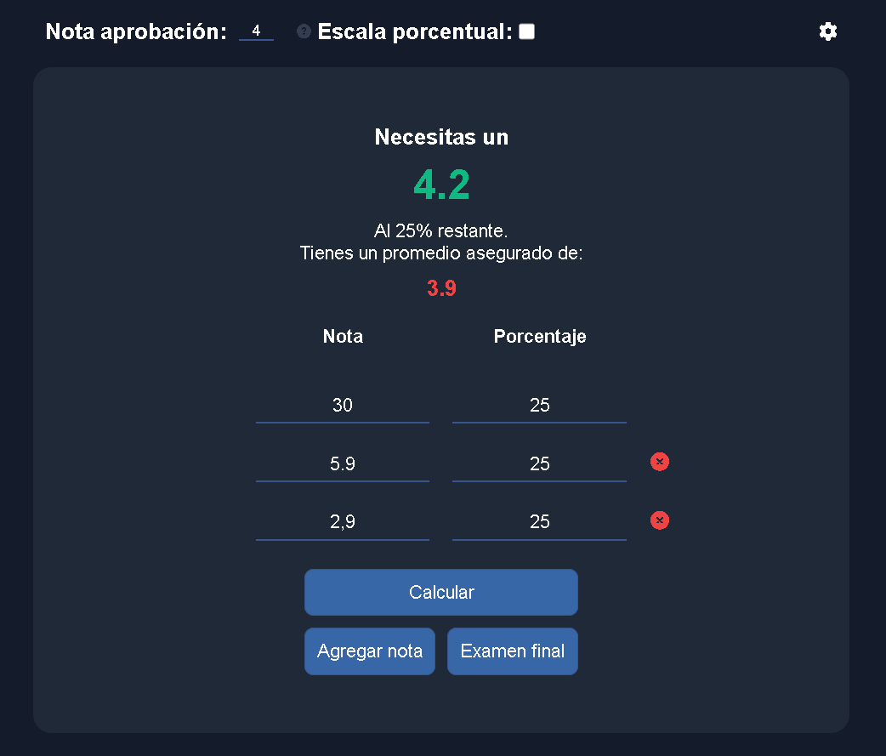

# 🧮 Calculadora de Notas Personalizada

> 💡 *Una herramienta interactiva para calcular notas con estilos personalizables y configuración avanzada. De un estudiante para estudiantes.*

---

## 🇨🇱 ¿Qué es esto?

Esta es una calculadora de notas pensada para estudiantes universitarios chilenos que:

- Necesitan saber **qué nota necesitan** en la próxima prueba para aprobar.
- Quieren ingresar las notas sin preocuparse del formato.
- Buscan una experiencia visual agradable (hay paletas de colores!)

---

## ⚙️ Características

- ✅ Modo intuitivo: rellenas lo que tienes, y calcula lo que falta.
- ✅ Soporte de coma y punto como separador decimal (`5,5` o `5.5`), incluso sin decimales.
- ✅ Ventana de configuración.
- ✅ Estilo personalizable.
- ✅ Validación visual si la nota requerida es imposible.
- ✅ Escala 1 al 100.

---

## 📦 Cómo usarla

1. Ve a [este link](https://marcentella.github.io/ponderacion-de-notas/)
2. Ingresa tus notas en las casillas.
4. (Opcional) Haz clic en el engranaje ⚙️ para ajustar configuraciones avanzadas.
3. Presiona **Calcular**.
5. Revisa tus resultados.

---

## ✨ Preview

---

## 🛠️ Tecnologías utilizadas

- HTML + CSS3
- JavaScript (vanilla)
- [Font Awesome](https://fontawesome.com) para los íconos

---
---

## 🌐 English Version

# 🧮 Custom Grade Calculator

> 💡 *An interactive tool to calculate final grades with custom themes, and advanced configuration. From a student to students*

---

## 🇨🇱 What is this?

This is a grade calculator designed for Chilean university students who:

- Need to know **what grade they need** on the next exam to pass.
- Want to enter grades without worrying about the format.
- Are looking for a pleasant visual experience (yes, there are color palettes!)

---

## ⚙️ Features

- ✅ Intuitive mode: fill in what you have, and it calculates what you're missing.
- ✅ Supports both commas and dots as decimal separators (`5.5` or `5,5`), even with no decimals.
- ✅ Settings window.
- ✅ Customizable style.
- ✅ Visual validation if the required grade is impossible.
- ✅ Scale from 1 to 100.

---

## 📦 How to use it

1. Go to [this link.](https://marcentella.github.io/ponderacion-de-notas/)
2. Enter your grades in the fields.
3. (Optional) Click the ⚙️ gear icon to adjust advanced settings.
4. Press **Calculate**.
5. Check your results.

---

## 🛠️ Tech stack

- HTML + CSS3  
- JavaScript (vanilla)  
- [Font Awesome](https://fontawesome.com) for icons
